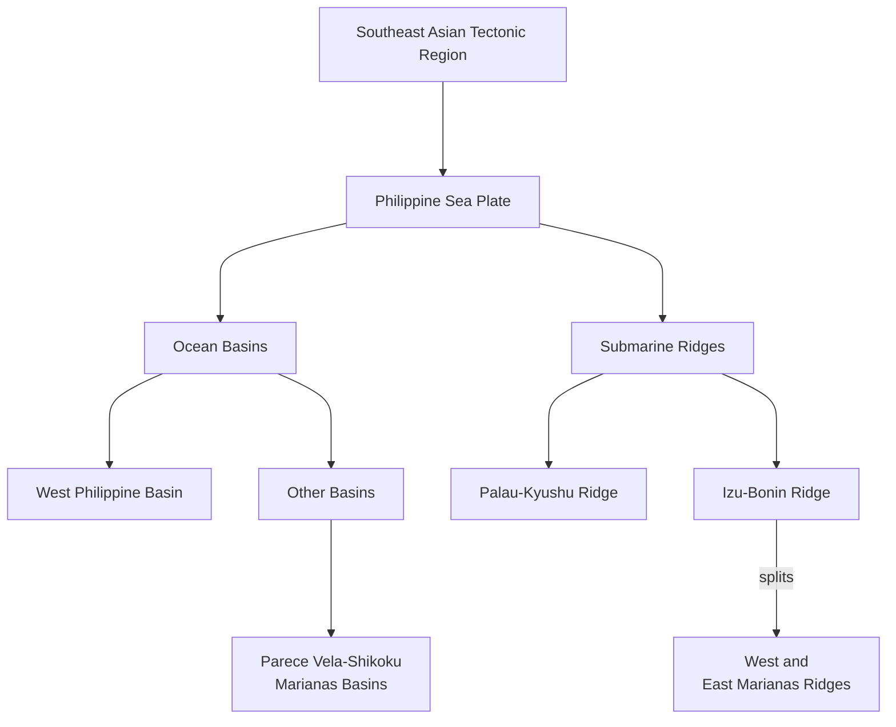

# Philippine Sea Plate
# Philippine Sea Plate
Tectonic activity in the Philippines is the result of the interaction of three major tectonic plates of the **Western Pacific Domain**

*to be updated:

**Philippine Sea Plate** 
- oceanic plate east of the Philippine archipelago
- isolated from its mid-ocean ridge reference ciro
- almost entirely surrounded by subduction zones
	- Bonin-Marianas-Yap Trench to the east
	- Nankai-Ryuku Ridge to the northwest
	- East Luzon-Philippine Trench to the southwest
- 8-9 mm/year PSP convergence to the east of the Ph Archipelago

>[!remark]
there are **two models** in terms of the basin's origin:
>- trapped oceanic basin
> - back-arc basin model
>> In the back-arc basin model, Oki-Daito Ridge would correspond to a relict volcanic arc that travelled to the NE during the opening of the basin

**Central Basin Fault**
>composed of a series of en echelon ridges whose orientation makes an angle of around $15\degree$ to its general direction (WNW-ESE)

## Marginal Basins of the Philippine Sea Plate

PSP - only plate bounded bounded by trenches

add trenches

west to east - younging

[[SG32 - Philippine Sea Basin]]
[[SG30 - Sulu Sea Basin]]              
[[SG31 - Celebes Sea Basin]]

|     |        |                                                 |                                                     |                                                       |
| --- | ------ | ----------------------------------------------- | --------------------------------------------------- | ----------------------------------------------------- |
| WPB | oldest | model 1: Uyeda and Ben-Avrahan (1972)           | ![[Pasted image 20250705072743.png]]                | - cannot explain the northward translation (paleomag) |
|     |        | model 2: Back-arc basin evolution, Karig (1971) | ![[Pasted image 20250705072902.png]]                |                                                       |
|     |        |                                                 | central basin fault, central basin spreading center |                                                       |
|     |        |                                                 | clockwise rotation ng basin                         | <- legit                                              |
|     |        |                                                 |                                                     |                                                       |
|     |        |                                                 |                                                     |                                                       |
#### West Philippine Basin
- largest and oldest
- Gagua Ridge separates the WPB and Huatung Basin
- Palau-Kyushu Ridge - separated into three
	- Palau-Kyushu Ridge
	- Oki-Daito Ridge
	- Daito Ridge

Models
1. Back-arc basin evolution
- roll-back in two subduction zones caused the extension of the overriding plate (WPB)
1. Trapped piece of oceanic plate (WSP as a trapped piece of the Pacific Plate)

# Regional

| Regions      |
| ------------ |
| [[Luzon]]    |
| [[Visayas]]  |
| [[Mindanao]] |

**Stratigraphic Groupings**
see [[GEOPSEA.base#Stratigraphic Groups]]

![[z_attachments/Map - Stratigraphic Groupings in the Philippines.png]]